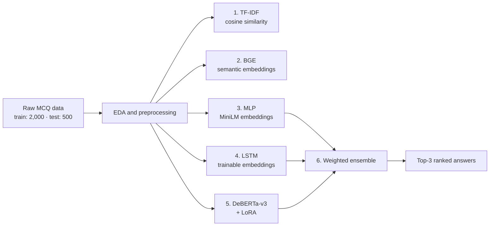

# Smart MCQ Solver Challenge

**Ranked answer prediction for multiple-choice questions, from TF-IDF retrieval to LoRA-tuned DeBERTa and a weighted neural ensemble.**

Course project for **Introduction to Deep Learning and Generative AI (BSDA2001P)**, IIT Madras.

## Contents

- [Overview](#overview)
- [Highlights](#highlights)
- [Evaluation Metric](#evaluation-metric)
- [Dataset](#dataset)
- [Exploratory Data Analysis and Preprocessing](#exploratory-data-analysis-and-preprocessing)
- [Methodology](#methodology)
- [Results](#results)
- [Validation vs. Leaderboard Gap](#validation-vs-leaderboard-gap)
- [Experiment Tracking](#experiment-tracking)
- [Key Learnings](#key-learnings)
- [Limitations](#limitations)
- [Future Work](#future-work)
- [Reproducing the Project](#reproducing-the-project)
- [Tech Stack](#tech-stack)
- [References](#references)
- [Author](#author)

## Overview

Each question in the challenge has five options (A–E). The task is to return the **three most probable answers in ranked order**. Submissions are scored with **MAP@3**, so both *which* answer is chosen and *where it is ranked* matter.

The project follows a progressive strategy. Each stage adds representational power over the previous one, and the strongest neural models are combined at the end:



## Highlights

- **Best Kaggle MAP@3: 0.75436**, from a weighted ensemble of the MLP, LSTM, and DeBERTa-v3 models.
- More than **doubled the TF-IDF baseline** (0.36210 → 0.75436).
- The **custom MLP over sentence embeddings was the best single model** (0.75228), narrowly ahead of LoRA-tuned DeBERTa-v3 (0.74480). It trains only on precomputed embeddings, so it is much cheaper to train.
- Validation scores (up to 1.0000) were far higher than leaderboard scores, so the [gap](#validation-vs-leaderboard-gap) is analysed rather than ignored.

## Evaluation Metric

**Mean Average Precision at 3 (MAP@3)** rewards placing the correct answer early in the ranked list. Each question has exactly one correct answer, so its score is simply `1 / rank`, or `0` if the answer is outside the top three.

| Rank of correct answer | Score |
|---|---:|
| 1st | 1.0000 |
| 2nd | 0.5000 |
| 3rd | 0.3333 |
| 4th or 5th | 0.0000 |

```text
MAP@3 = (1 / N) · Σ score_i        score_i = 1 / rank_i   if rank_i ≤ 3, else 0
```

Example: if the model outputs `C, A, B` and the correct answer is `A`, that question scores 0.5.

**Reference point:** ranking the options at random gives an expected MAP@3 of (1 + 1/2 + 1/3) / 5 ≈ **0.367**, regardless of how the answers are distributed. Scores near this value indicate chance-level performance.

## Dataset

The project uses the **Smart MCQ Solver Challenge** dataset.

| Split | Rows | Columns |
|---|---:|---:|
| Training | 2,000 | 8 |
| Test | 500 | 7 |

**Training columns:** `id`, `prompt`, `A`, `B`, `C`, `D`, `E`, `answer`. The test set has the same question and option columns but no `answer`.

| Statistic | Value |
|---|---|
| Missing values | None in the training data |
| Duplicate prompts | 242 (12.1% of training rows) |
| Average prompt length | 18.15 words |
| Average option length | 26.28 words |
| Average word length in prompts | 5.56 characters |

Options are longer than the questions on average, so much of the signal sits in the option text.

### Answer distribution

| Answer | Proportion |
|---|---:|
| A | 18.45% |
| B | 24.50% |
| C | 22.95% |
| D | 17.90% |
| E | 16.20% |

All five labels are represented, with mild imbalance (B is most common, E least). This motivated the option-shuffle augmentation used for the Transformer.

## Exploratory Data Analysis and Preprocessing

### Exploratory analysis

The analysis examined answer-label distribution, prompt and option lengths, frequent words, domain diversity, whether questions are self-contained, and duplicate prompts.

- **Broad domain coverage:** physics, astronomy, biology, chemistry, mathematics, engineering, and environmental science. This favours semantic representations over keyword matching.
- **Repeated instruction templates:** frequent terms such as `correct`, `following`, `answer`, `option`, `choices`, `determine`, `select`, and `identify` come from boilerplate rather than subject matter, which adds textual noise.

### Preprocessing

| Step | Applies to | Detail |
|---|---|---|
| Load and validate | All models | CSVs loaded with Pandas; missing values, data types, and duplicate prompts checked |
| Deduplication | MLP, LSTM | Duplicate question–option combinations removed before the train/validation split |
| Sentence embeddings | MLP | Question and option text converted to semantic embeddings |
| Vocabulary and padding | LSTM | 3,461-token vocabulary, padding, and unknown-word handling |
| Tokenization | DeBERTa | Prompt–option pairs tokenized with a maximum length of 256 tokens |
| Option-shuffle augmentation | DeBERTa | Training set expanded from 1,700 to 3,400 rows |

## Methodology

### 1. TF-IDF cosine similarity (baseline)

The question and each candidate option are represented as sparse TF-IDF vectors, and options are ranked by cosine similarity to the question. This is a purely lexical baseline.

### 2. BGE semantic embeddings (baseline)

Questions and options are embedded with **`BAAI/bge-base-en-v1.5`** and ranked by embedding similarity. This tests whether semantic representations capture relationships that word overlap misses.

### 3. Custom MLP

The question and all five options are embedded with **`sentence-transformers/all-MiniLM-L6-v2`** and concatenated into one feature vector. With 384-dimensional embeddings, that is 6 × 384 = 2,304 input features (about 591K trainable parameters in the classifier).

```text
Question + 5 Options
        ↓
Concatenation (6 embeddings)
        ↓
Dense layer (256 units)
        ↓
ReLU
        ↓
Dropout (p = 0.3)
        ↓
5 output logits
```

| Setting | Value |
|---|---|
| Loss | Cross-entropy |
| Optimizer | Adam |
| Learning rate | 0.001 |
| Weight decay | 0.001 |
| Early stopping | On validation MAP@3 |

Validation MAP@3 first reached **1.0000 at epoch 53** and stayed there until early stopping at epoch 63.

### 4. LSTM (RNN model)

The required recurrent model is an **LSTM with trainable word embeddings**.

```text
Question / Option
        ↓
Embedding
        ↓
LSTM
        ↓
Concatenation
        ↓
Classifier
```

| Setting | Value |
|---|---|
| Vocabulary size | 3,461 tokens |
| Sequence length | 40 tokens |
| Embedding dimension | 64 |
| LSTM hidden dimension | 64 |
| Classifier dimension | 64 |
| Epochs | 150 |
| Loss | `BCEWithLogitsLoss` |
| Optimizer | Adam (learning rate 0.001) |

Training loss fell from **0.7161 at epoch 1** to **0.0586 at epoch 150**.

### 5. DeBERTa-v3-base with LoRA

**`microsoft/deberta-v3-base`** is configured for multiple-choice classification. Each question yields five prompt–option pairs, truncated to 256 tokens. LoRA keeps fine-tuning lightweight: only **1,771,009 of 186,193,922 parameters (about 0.95%)** are trainable.

| LoRA setting | Value |
|---|---|
| Target modules | `query_proj`, `value_proj` |
| Rank (`r`) | 32 |
| Alpha | 32 |
| Dropout | 0.1 |
| Also trainable | Classifier and pooler |

| Training setting | Value |
|---|---|
| Epochs | 15 |
| Learning rate | 2 × 10⁻⁴ |
| Train batch size | 4 |
| Gradient accumulation | 4 (effective batch size 16) |
| Eval batch size | 8 |
| Weight decay | 0.01 |
| Warm-up ratio | 0.1 |
| Augmentation | Option shuffling (1,700 → 3,400 rows) |

Longer training improved the leaderboard score:

| Epochs | Kaggle MAP@3 |
|---:|---:|
| 8 | 0.70 |
| 10 | 0.72236 |
| 15 | 0.74480 |

### 6. Weighted ensemble

The final submission sums the weighted probability outputs of the three neural models for each answer choice and keeps the top three.

| Model | Weight |
|---|---:|
| MLP | 0.35 |
| LSTM | 0.28 |
| DeBERTa-v3 | 0.37 |

## Results

| Approach | Validation MAP@3 | Kaggle MAP@3 | Description |
|---|---:|---:|---|
| Random ranking (theoretical) | n/a | ≈ 0.367 | Expected score of a random top-3 |
| TF-IDF cosine similarity | Not recorded | 0.36210 | Lexical baseline |
| BGE embeddings | Not recorded | 0.43225 | Semantic retrieval |
| LSTM | 0.7978 | 0.66749 | Trainable embeddings + recurrent encoder |
| DeBERTa-v3 + LoRA | 0.9883 | 0.74480 | Fine-tuned Transformer |
| Custom MLP | 1.0000 | 0.75228 | Sentence embeddings + feedforward network |
| **Weighted ensemble** | Not recorded | **0.75436** | MLP + LSTM + DeBERTa |

What the results show:

- **TF-IDF performs at roughly chance level.** Its 0.36210 is essentially the random-ranking reference (≈ 0.367), so word overlap carries little signal on this dataset.
- **Semantic embeddings help, but a trained model on top matters more.** BGE similarity (0.43225) is above chance, while the MLP on sentence embeddings reaches 0.75228.
- **The ensemble margin is small.** It beats the best single model by +0.0021 and DeBERTa by +0.0096. With only 500 test questions, differences of this size may not be statistically meaningful.
- **The LSTM is clearly the weakest neural model.** Its training loss collapsed (0.7161 → 0.0586) while its leaderboard score stayed at 0.667, which is consistent with overfitting on a small dataset.

## Validation vs. Leaderboard Gap

Validation scores were much higher than Kaggle scores for every neural model:

| Model | Validation MAP@3 | Kaggle MAP@3 | Gap |
|---|---:|---:|---:|
| Custom MLP | 1.0000 | 0.75228 | 0.2477 |
| DeBERTa-v3 + LoRA | 0.9883 | 0.74480 | 0.2435 |
| LSTM | 0.7978 | 0.66749 | 0.1303 |

A perfect validation score followed by 0.75 on the leaderboard means the validation split was **not a reliable proxy for test performance**. Possible explanations, not yet confirmed, are:

- **Train/validation overlap.** The dataset has 242 duplicate prompts, and deduplication targeted exact question–option combinations. Repeated prompts or near-duplicates with different options could still appear on both sides of a split.
- **Small validation set.** A small held-out set gives noisy estimates and is easy to saturate.
- **Distribution shift.** Test questions may differ in difficulty or topic mix from the training questions.

The models with the highest validation scores show the largest gaps, which is what leakage or overfitting to the validation split would produce. A grouped split by prompt and k-fold cross-validation would test these explanations (see [Future Work](#future-work)).

## Experiment Tracking

Selected experiments and Kaggle leaderboard scores were logged with **Weights & Biases (W&B)**, covering the TF-IDF baseline, BGE embeddings, MLP, LSTM, DeBERTa-v3, and the weighted ensemble.

## Key Learnings

- **MAP@3 rewards ranking, not only correctness.** Good runner-up predictions earn partial credit.
- **Lexical similarity is not enough.** TF-IDF performed at chance level, while semantic embeddings captured relationships it missed.
- **Bigger is not automatically better.** A small MLP on frozen sentence embeddings (0.75228) matched or slightly beat a LoRA-tuned 186M-parameter Transformer (0.74480) at a fraction of the training cost.
- **Fine-tuning benefits from more training.** DeBERTa's leaderboard score rose from 0.70 to 0.74480 between 8 and 15 epochs.
- **Option-shuffle augmentation** reduces dependence on answer position.
- **Validation can mislead.** Strong validation numbers did not transfer to the leaderboard, so split design matters as much as model choice.
- **Ensembling complementary models helps, modestly.** Combining architecturally different models gave the best score, though the gain over the best single model was small.

## Limitations

- Validation results do not reliably predict leaderboard performance (see the [analysis above](#validation-vs-leaderboard-gap)).
- The training set is small (2,000 rows) and contains 242 duplicate prompts, which raises the risk of overfitting and split leakage.
- Repeated instruction templates add noise to the text.
- Reported results come from recorded runs; no cross-validation or multi-seed statistics are provided.
- Validation scores were not recorded for the TF-IDF, BGE, and ensemble runs, so those are compared on Kaggle score only.
- There is no retrieval component, so questions that need outside knowledge rely on what the pretrained models already encode.
- Ensemble weights and probability calibration have room for improvement.
- Transformer fine-tuning is far more expensive than embedding-based approaches.

## Future Work

- Use **grouped splits by prompt** and **k-fold cross-validation** to get trustworthy validation estimates.
- Optimize ensemble weights and improve probability calibration on a held-out validation set.
- Try stronger **cross-encoder and reranking** architectures.
- Investigate **retrieval-augmented** methods for questions that need external knowledge.
- Run systematic hyperparameter optimization and report results across multiple seeds.
- Experiment with larger or more domain-aware language models.
- Log complete training and validation curves to W&B for every experiment.

## Reproducing the Project

1. **Get the data.** Download the Smart MCQ Solver Challenge training and test CSV files from the Kaggle competition page and place them where the notebook expects them.
2. **Install dependencies.** For example:

   ```bash
   pip install pandas numpy scikit-learn torch sentence-transformers transformers peft wandb
   ```

   Pin versions from your own environment if you need exact reproducibility.
3. **Run the notebook.** Open `dl-23f1002260-notebook-t22026.ipynb` and run it top to bottom. A GPU is recommended for the DeBERTa fine-tuning stage.
4. **Optional: enable W&B logging.** Run `wandb login` before training to reproduce the experiment tracking.

## Tech Stack

| Area | Tools |
|---|---|
| Language | Python |
| Data and classical ML | Pandas, NumPy, Scikit-learn |
| Deep learning | PyTorch |
| Embeddings | Sentence Transformers (`all-MiniLM-L6-v2`), BGE (`bge-base-en-v1.5`) |
| Transformers and fine-tuning | Hugging Face Transformers, DeBERTa-v3, LoRA (PEFT) |
| Sequence models | LSTM |
| Experiment tracking | Weights & Biases |
| Platform | Kaggle |

## References

1. Kaggle: Smart MCQ Solver Challenge
2. He et al., [*DeBERTaV3: Improving DeBERTa using ELECTRA-Style Pre-Training with Gradient-Disentangled Embedding Sharing*](https://arxiv.org/abs/2111.09543) (2021)
3. Hu et al., [*LoRA: Low-Rank Adaptation of Large Language Models*](https://arxiv.org/abs/2106.09685) (2021)
4. [`microsoft/deberta-v3-base`](https://huggingface.co/microsoft/deberta-v3-base)
5. [`BAAI/bge-base-en-v1.5`](https://huggingface.co/BAAI/bge-base-en-v1.5)
6. [`sentence-transformers/all-MiniLM-L6-v2`](https://huggingface.co/sentence-transformers/all-MiniLM-L6-v2)
7. Hugging Face Transformers, PyTorch, Scikit-learn, Weights & Biases documentation
8. Project notebook: `dl-23f1002260-notebook-t22026.ipynb`

## Author

**Atharv Singh**
B.Tech Mechanical Engineering | Data Science and AI/ML

**Project:** Smart MCQ Solver Challenge
**Course:** BSDA2001P, Introduction to Deep Learning and Generative AI (IIT Madras, B.S. in Data Science and Applications)
